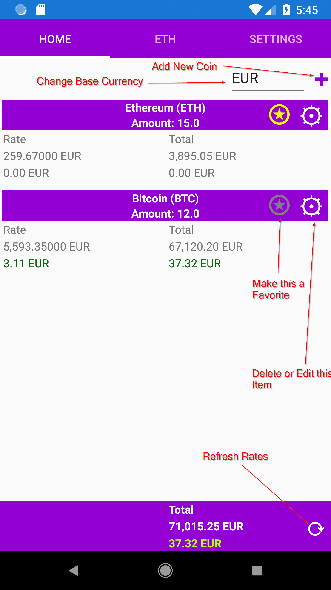
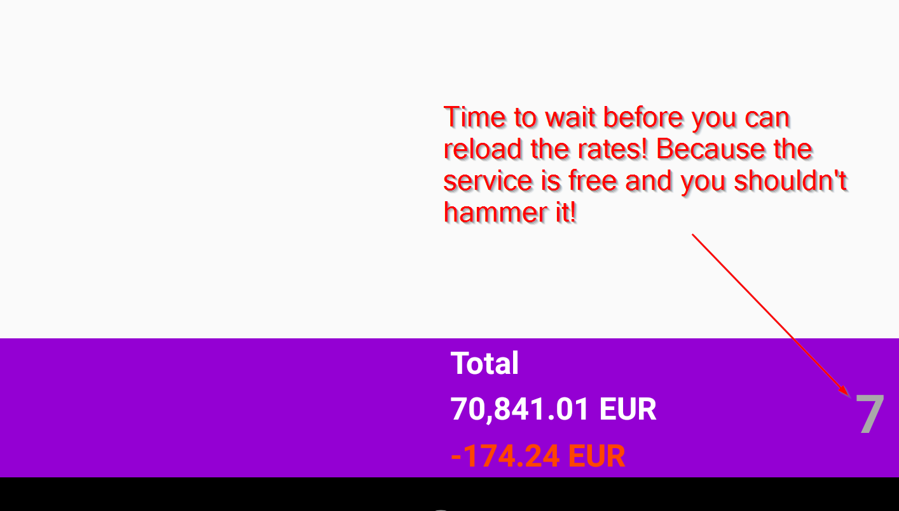
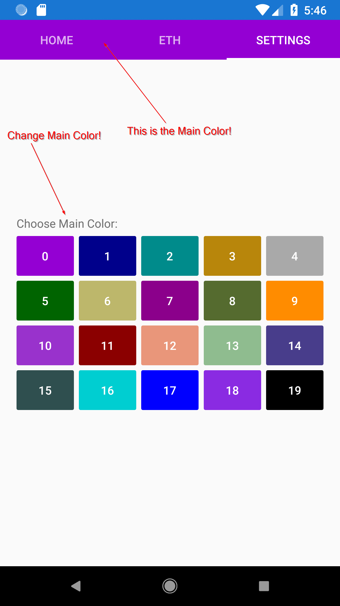

# MyCryptoPortfolio

Manages your crypto portfolio on your phone and shows changes to the last rate update.

This app is written in F#, Xamarin and Xamarin.Elmish. (awesome tools)

It's under the MIT Licence.

I use [cryptocompare.com]() to get the current rates and the available symbols for all the crypto currencies. Thanks to these guys. You are awesome.

There is another App named MyCryptoPortfolio in the Windows App Store. The current Version is a rewrite and redesign in F#.

Have fun.

Btw. Please note, that I am using Exceptions in my service code. The first approache was the using of Result. But I ran into a strange error on debugging on my Huawei P20.

The function in the service file return correctly Async<Result<ExRate list, string>>. But the consuming function App.fs -> getRates, gets a strange error message, something with Argument bla, and on "Ok x" x is an integer. So I change to the exception thingy.

# Description of the App

